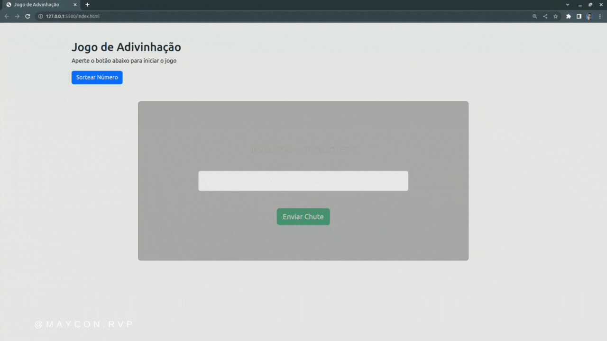

# Jogo de Adivinhação

Projeto desenvolvido para prática de lógica de programação e manipulações de DOM. Trata-se de um simples jogo de adivinhação, onde o usuário ao iniciar o jogo clicando no botão "Iniciar Jogo" poderá dar alguns chutes a fim de acertar o número que é escolhido ramdomicamente a cada click no botão "Iniciar Jogo".

## Tecnologias Utilizadas

* HTML
* CSS
* Javascript
* Bootstrap
* Bootbox
## Demonstração

  

